# React CRUD

A JavaScript React frontend for managing products through a separately supplied HTTP API. This guide walks from installation through every application file and Create, Read, Update, and Delete operation.

The **frontend** is the interface running in your browser. The **backend** is the external server handling requests and persistence. Only the frontend is included: no backend startup command, database schema, authentication layer, Express server, or MongoDB configuration exists here.

## Contents

- [Purpose and features](#purpose-and-features)
- [Architecture](#architecture)
- [Stack and dependencies](#stack-and-dependencies)
- [Beginner setup](#beginner-setup)
- [npm scripts](#npm-scripts)
- [Repository guide](#repository-guide)
- [Rendering and routes](#rendering-and-routes)
- [State and forms](#state-and-forms)
- [API and CRUD operations](#api-and-crud-operations)
- [Styling and deployment](#styling-and-deployment)
- [Troubleshooting and limitations](#troubleshooting-and-limitations)
- [Glossary and reading order](#glossary-and-reading-order)
- [Complete dependency inventory](#complete-dependency-inventory)

## Purpose and features

**CRUD** means four operations on data:

| Operation | Product example | Implemented interface |
| --- | --- | --- |
| Create | Add a notebook with quantity, price, image URL | Create Product form |
| Read | View products or load one for editing | Home cards and edit fetch |
| Update | Change the notebook's quantity or name | Update Product form |
| Delete | Remove the notebook after confirmation | Delete button and dialog |

The app displays product images, names, quantities, and prices; links between three pages; shows loading/empty states; and reports mutations with toast notifications. Home has two grid columns by default and four at the large breakpoint. Create/update return home after success; delete fetches the list again. These behaviors need a compatible reachable API. Search, pagination, authentication, uploads, and automated tests are not implemented.

## Architecture

An **API** (application programming interface) is the contract used to communicate with a server. **HTTP** is the request/response protocol used here. An **endpoint** is a server path and method for an operation. **JSON** (JavaScript Object Notation) is the data text format used to exchange products.

This diagram separates browser code from external services.

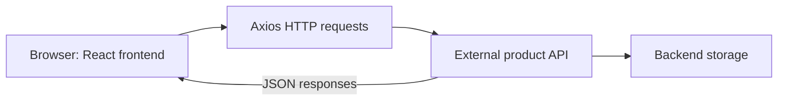

Text equivalent: browser → Axios → API → unspecified storage, with JSON returned to the frontend. Backend storage is outside this repository. `_id` does not prove a particular database.

`src/App.jsx` exports the configuration value:

```js
export const VITE_BACKEND_URL = import.meta.env.VITE_BACKEND_URL;
```

Pages and Product import it from App. There is no centralized Axios client or API proxy. Node.js runs frontend tools; it does not imply an included Node backend.

## Stack and dependencies

A **dependency** is a package the project uses. A **bundler** transforms and packages source into browser assets. **Linting** statically checks code against rules without proving application behavior.

**JSX** is JavaScript syntax resembling HTML for describing UI. A **component** is a reusable UI function. **State** is remembered component data; **props** are parent-provided inputs. A **hook** provides React capabilities; an **effect** runs after rendering to synchronize with an external system. To **render** is to calculate UI and update the browser's **DOM** (Document Object Model), its element tree. **Routing** selects UI by URL, and a **route parameter** is a variable path segment.

| Layer | Tools | Responsibility |
| --- | --- | --- |
| Language | JavaScript ES modules, JSX | Modules and UI descriptions |
| UI | React, React DOM | Components, state, effects, rendering |
| Navigation | React Router DOM | Routes, links, parameters, redirects |
| HTTP | Axios | External API requests |
| Styling | Tailwind CSS, Tailwind Vite plugin | Generate utility CSS |
| Feedback | React Toastify, SweetAlert2 | Toasts, delete confirmation |
| Development/build | Vite, React plugin | Dev server, transforms, refresh, build |
| Code checks | ESLint, Hooks/Refresh plugins | JavaScript and React rules |

**JSX** is JavaScript syntax resembling HTML for describing UI. A **component** is a reusable function describing part of that UI. The app is JavaScript, not TypeScript; `@types/*` packages provide declarations/editor support.

### All 17 direct dependencies

`dependencies` lists packages used by application code; `devDependencies` lists build, lint, and editor tools. Development dependencies are needed to build even though a deployed static site does not run npm. This grouping does not mean every runtime package's entire contents ship to the browser.

Versions were reconciled with `package.json`, the complete lockfile, and installed manifests. All installed direct versions match locked versions.

| Package | Group | Declared range | Locked version | Installed version | Purpose and use |
| --- | --- | --- | --- | --- | --- |
| `axios` | Runtime | `^1.20.0` | `1.20.0` | `1.20.0` | Requests in pages and `src/components/Product.jsx` |
| `react` | Runtime | `^19.2.8` | `19.3.0` | `19.3.0` | Components, state/effects; StrictMode in main |
| `react-dom` | Runtime | `^19.2.8` | `19.3.0` | `19.3.0` | `createRoot` in `src/main.jsx` |
| `react-router-dom` | Runtime | `^7.18.4` | `7.18.4` | `7.18.4` | Router in main, routes in App, links/parameters/navigation in pages and Product |
| `react-toastify` | Runtime | `^11.1.0` | `11.1.0` | `11.1.0` | ToastContainer in App; toasts in Create/Edit/Product |
| `sweetalert2` | Runtime | `^11.26.25` | `11.26.25` | `11.26.25` | Delete confirmation in Product |
| `@eslint/js` | Development | `^10.0.1` | `10.0.1` | `10.0.1` | JS recommended rules in `eslint.config.js` |
| `@tailwindcss/vite` | Development | `^4.3.3` | `4.3.3` | `4.3.3` | Tailwind integration in `vite.config.js` |
| `@types/react` | Development | `^19.2.18` | `19.3.0` | `19.3.0` | React declarations/editor support; no app import |
| `@types/react-dom` | Development | `^19.2.7` | `19.3.0` | `19.3.0` | React DOM declarations/editor support; no app import |
| `@vitejs/plugin-react` | Development | `^6.1.1` | `6.1.1` | `6.1.1` | React transforms/refresh in `vite.config.js` |
| `eslint` | Development | `^10.10.0` | `10.11.0` | `10.11.0` | Lint script and config helpers |
| `eslint-plugin-react-hooks` | Development | `^7.1.1` | `7.1.1` | `7.1.1` | Hooks rules in `eslint.config.js` |
| `eslint-plugin-react-refresh` | Development | `^0.5.6` | `0.5.7` | `0.5.7` | Refresh export rules in `eslint.config.js` |
| `globals` | Development | `^17.12.0` | `17.12.0` | `17.12.0` | Browser global definitions for ESLint |
| `tailwindcss` | Development | `^4.3.3` | `4.3.3` | `4.3.3` | Imported in `src/index.css`; utilities throughout JSX |
| `vite` | Development | `^8.3.0` | `8.3.1` | `8.3.1` | Dev/build/preview scripts and configuration helper |

A **direct** dependency appears in `package.json`; a **transitive** dependency is required by another package. npm installs both, hence more than 17 packages. Semantic versioning uses major/minor/patch numbers. A caret such as `^19.2.8` permits compatible releases below the next major; the lockfile fixes the resolved version, here `19.3.0`. `npm ci` follows those exact resolutions. Optional platform packages may be locked without being installed. The complete appendix records nested paths and local status.

## Beginner setup

### 1. Prepare tools

Install Node.js 24 and its bundled npm package manager. This recommendation follows installed engine metadata, not a claim about the latest Node release. ESLint declares `^20.19.0 || ^22.13.0 || >=24`; Vite declares `^20.19.0 || >=22.12.0`. Node 18 does not meet these requirements.

You need a browser, editor, repository folder, and separately supplied API matching the [contract](#api-and-crud-operations). A **terminal**, such as PowerShell, runs commands. Check:

```sh
node --version
npm --version
```

Each prints a version. If unrecognized, install Node or fix PATH and reopen the terminal. The inspection machine reported Node `v24.19.0`, npm `12.0.2`; these are observations, not required exact versions.

### 2. Install the locked packages

```sh
cd <path-to-react-crud>
npm ci
```

Replace the angle-bracket placeholder with your actual folder path; do not type the brackets. Quote real paths with spaces. Run later npm commands from the folder containing `package.json`.

`npm ci` installs the locked graph into `node_modules`, replacing any existing installation. It requires agreement between package and lockfile. Expect installation output and successful completion; resolve engine/dependency errors first. This setup command was not run during the README update.

### 3. Configure the separate API

An **environment variable** is named configuration. Source expects `VITE_BACKEND_URL`. Manually create or edit `.env` beside `package.json` in your editor. This is **only an illustrative localhost example**:

```dotenv
VITE_BACKEND_URL=http://localhost:3000
```

Use it only if you separately have a compatible API running there; otherwise supply your API's real base URL. Omit trailing slash and `/api/products`, which the app appends itself. No backend startup command exists here.

Environment files, including `.env.example`, were not inspected; their contents/correctness are not asserted. `.gitignore` does not explicitly ignore `.env`. Protect configuration and review what you stage for version control.

`VITE_*` values are public browser configuration, not secrets. Restart Vite after changes. Values are substituted at build time in production; rebuild and redeploy when production configuration changes.

### 4. Run the frontend

```sh
npm run dev
```

Open the URL Vite prints. Its usual port is `5173`, but it can choose another if busy. Keep the terminal running; Ctrl+C stops it.

CRUD requires a reachable API and correct **CORS** (Cross-Origin Resource Sharing), the server policy permitting browser access across origins. An origin is scheme, host, and port. Illustrative frontend `http://localhost:5173` and API `http://localhost:3000` are separate origins. The API must allow the actual frontend origin, methods and headers. Frontend configuration cannot set the backend's policy.

### 5. Try CRUD

1. Open home: successful GET shows cards or an empty message for `[]`.
2. Click **Create Product**, enter four fields and an accessible image URL, then **Save**. Success toasts and returns home.
3. Click a card's **Edit**, change fields, then **Update**. Success returns home.
4. Click **Delete**: cancel sends nothing; confirmation sends DELETE and success refreshes the list.

These are expected behaviors, not a recorded live test. Use data you are allowed to modify.

## npm scripts

| Command | Script | Expected result |
| --- | --- | --- |
| `npm run dev` | `vite` | Frontend dev server with transforms/refresh |
| `npm run build` | `vite build` | Browser assets in `dist/`; no lint or backend startup |
| `npm run lint` | `eslint .` | Static rules check; current findings below |
| `npm run preview` | `vite preview` | Local inspection of an existing production build |

Preview needs a build first and is not production hosting. Existing `dist/` may be stale. No `npm start` or test script exists.

Dependency inspection commands:

```sh
npm ls --depth=0
npm ls --all
```

The first lists direct packages; the second shows the full tree. npm may report missing/invalid/extraneous dependencies and return nonzero. These are installation consistency findings, not automatically application failures. Only the direct listing was run for this update; the full tree command is provided for your inspection.

## Repository guide

Paths are relative to the repository root. `src/pages/HomePage.jsx` means `src` → `pages` → file. In imports, `./` means current folder and `../` means parent: Home's `../components/Product` resolves to `src/components/Product.jsx`.

```text
react-crud/
├── index.html
├── package.json
├── package-lock.json
├── vite.config.js
├── eslint.config.js
├── .gitignore
├── README.md
├── README-update-prompt.md
├── README-dependency-inventory.md
├── learn.html
├── public/
│   ├── favicon.svg
│   └── icons.svg
├── src/
│   ├── main.jsx
│   ├── App.jsx
│   ├── index.css
│   ├── components/Product.jsx
│   ├── pages/
│   │   ├── HomePage.jsx
│   │   ├── CreatePage.jsx
│   │   └── EditPage.jsx
│   └── assets/
│       ├── hero.png
│       ├── react.svg
│       └── vite.svg
├── dist/                  generated production output
└── node_modules/          installed third-party packages
```

Local environment files are excluded from inspection. Git internals are not application modules.

| File/directory | Responsibility |
| --- | --- |
| `index.html` | UTF-8, viewport, title `react-crud`, `#root`, module script `/src/main.jsx`; no favicon reference. |
| `src/main.jsx` | Imports CSS; createRoot mounts `StrictMode > BrowserRouter > App`. |
| `src/App.jsx` | Persistent navbar home link, content container, routes, ToastContainer, backend URL export. |
| `src/pages/HomePage.jsx` | Owns products/loading; initial GET; Create link; loading/empty/cards; `.map()` with `_id` keys; product and refresh callback props. |
| `src/components/Product.jsx` | Image/name/quantity/price, edit link, confirmation, DELETE, toasts, parent refresh callback. |
| `src/pages/CreatePage.jsx` | Separate four-field/loading states, controlled inputs, empty-string validation, POST, hidden pending Save, errors/reset, success redirect. |
| `src/pages/EditPage.jsx` | Route ID, initial GET, four-field object state, spread updates, PUT, loading/form branches, errors/reset, success redirect. |
| `src/index.css` | Tailwind import; base layer applies `bg-slate-400` to body. |
| `vite.config.js` | React and Tailwind plugins; no API proxy/server. |
| `eslint.config.js` | JS recommended, Hooks recommended, Refresh Vite rules; browser globals, JSX parsing; ignores `dist`. |
| `package.json` | Metadata, ES module mode, scripts, direct dependency ranges. |
| `package-lock.json` | Resolved graph, exact versions, integrity and resolution information; root entry is project metadata. |
| `.gitignore` | Ignores dependencies, builds, logs, local/editor artifacts; no explicit `.env` ignore. |
| `README.md` | Setup and implementation guide with current inventory. |
| `README-update-prompt.md` | Documentation support instructions; not an application module. |
| `README-dependency-inventory.md` | Prior snapshot reconciled here; documentation support, not executed. |
| `learn.html` | Standalone HTML/CSS cheat sheet with hard-coded cards; no React import or CRUD; Create/Edit placeholder description is outdated. |
| `public/favicon.svg` | Purple Vite-style static mark available as `/favicon.svg`; no current HTML/app reference. Name alone does not activate a favicon. |
| `public/icons.svg` | Symbol sprite: Bluesky, Discord, documentation, GitHub, social, X; available as `/icons.svg`, unused by app. |
| `src/assets/hero.png` | Two floating rounded slabs with purple lower edges; not imported/displayed. |
| `src/assets/react.svg` | Cyan React mark; not imported/displayed. |
| `src/assets/vite.svg` | Purple lightning mark with brackets; not imported/displayed. |
| `dist/index.html` | Generated HTML pointing to built JS/CSS; not authored root HTML. Presence does not verify freshness. |
| `dist/assets/*` | Generated hashed JS/CSS; filenames change between builds; compiled configuration values are not copied here. |
| `dist/favicon.svg`, `dist/icons.svg` | Generated copies of public assets. |
| `node_modules/` | npm-generated, Git-ignored third-party installation; inventoried via manifests rather than library source. |

Public assets are served at root paths and copied to builds. Source assets normally enter through imports; these three have none. Card images use API URLs, not local assets. Current executable code is authoritative over historical comments and learning material.
## Rendering and routes

The **DOM** (Document Object Model) is the browser's element tree. To **render** is to calculate UI and update displayed elements. JSX is transformed into JavaScript; React uses it to manage DOM, rather than inserting raw JSX into HTML.

### Startup

This flowchart shows mounting alongside the stylesheet import graph.

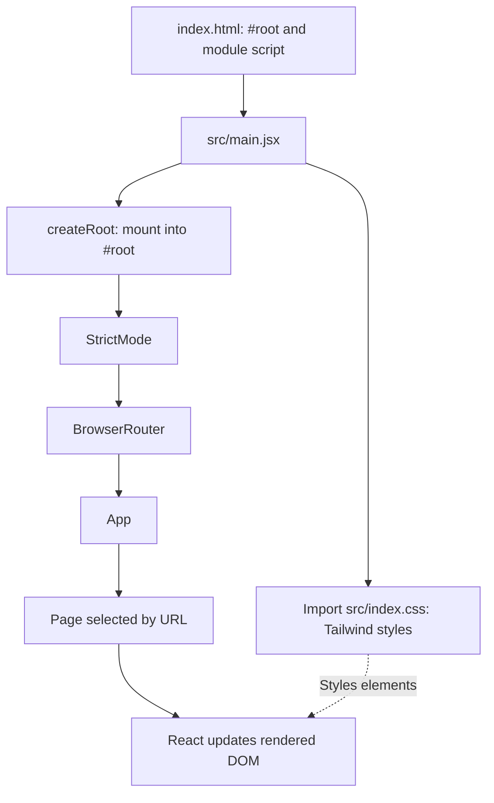

Text equivalent: HTML loads main; main imports CSS and mounts React; wrappers provide checks/routing; App selects a page; React updates DOM. CSS is in the import/build graph, not a component or final sequential render step.

Actual mounting begins:

```jsx
createRoot(document.getElementById('root')).render(
```

`document.getElementById('root')` locates the mount element; `createRoot` creates a React root; `.render(...)` mounts the nested wrappers and App. StrictMode adds development checks and can repeat initial effects during development.

### Component tree

This tree shows the persistent shell and alternative pages.

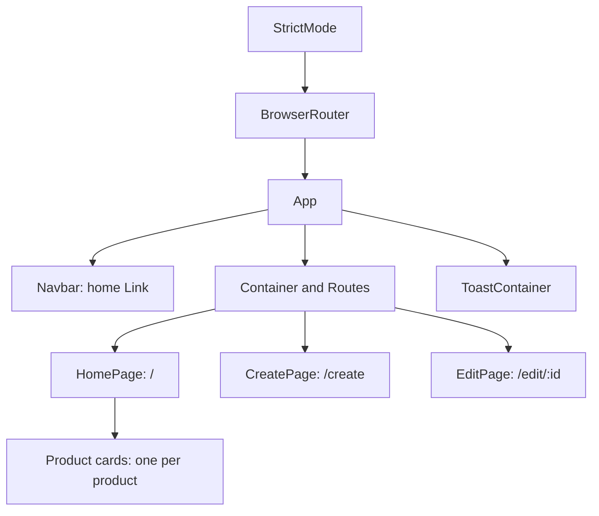

Text equivalent: StrictMode wraps BrowserRouter and App; App keeps navbar/toast container while Routes chooses Home, Create, or Edit. Only Home has Product children. Pages are alternatives, not simultaneously visible.

### Browser routes

**Routing** chooses a component from the browser URL. A **route parameter** is a variable segment such as `:id`.

| Browser route | Component | Purpose |
| --- | --- | --- |
| `/` | HomePage | List products; expose create/edit/delete |
| `/create` | CreatePage | Add a product |
| `/edit/:id` | EditPage | Load/update the selected ID |

App declares home with `<Route index element = { <HomePage/> }/>`. No explicit not-found route exists; unmatched paths select none of these pages while the shared shell remains.

This map shows navigation links and success redirects.

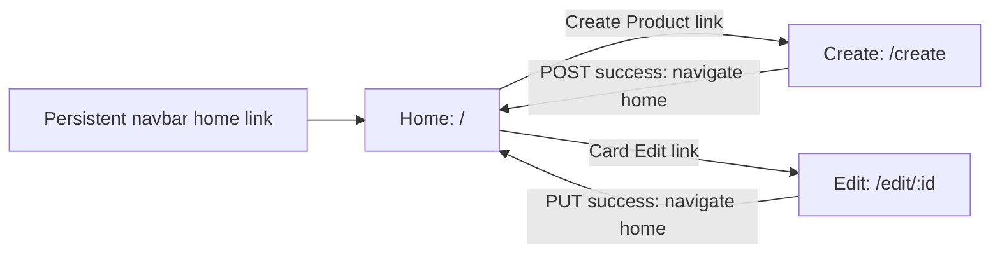

Text equivalent: Home links to Create or product-specific Edit; successful forms return home; navbar links home from every page. `/edit/abc` chooses UI, whereas `/api/products/abc` requests server data.

`Link` provides client navigation. `const navigate = useNavigate();` gets a router hook, and `navigate("/");` redirects on success. Edit reads `let {id} = useParams();` to get the ID from the path.

## State and forms

**State** is remembered component data. **Props** are parent-provided inputs. A **hook** is a React function such as `useState` or `useEffect` providing state/lifecycle behavior. An **effect** is post-render synchronization with something outside the UI calculation, such as an API request.

### List ownership and props

Home initializes:

```js
const [ products, setProducts ] = useState([]);
const [ isLoading, setIsLoading ] = useState(false);
```

`useState` returns current value and setter; bracket destructuring extracts both. `setProducts(response.data)` changes state and schedules rendering. Initially products is empty and loading false; the mount effect starts fetching:

```js
useEffect(() =>  {
    getProducts();
}, [])
```

The empty dependency array requests initial fetching for the mount, not exactly one request under all conditions. StrictMode can repeat effects in development. Neither fetch effect provides cancellation. Edit also uses an empty array: changing only `id` while the same instance stays mounted does not refetch.

`.map()` applies a function to each array item and returns a new array. Inside `products.map((product) => { ... })`, Home returns:

```jsx
< Product key = {product._id} product = {product} getProducts={getProducts} />
```

`key` helps React track list items across updates and requires stable unique IDs; it is a React tracking attribute, not a normal prop received by Product. `product` supplies card data. `getProducts` is a **callback**, a function passed for later invocation.

This diagram follows parent-owned data and child-triggered refresh.


Text equivalent: Home owns data, sends each card a product and refresh function, and updates its own state after a child requests refresh. Product has no separate list state or optimistic card removal.

### Controlled inputs

A **controlled input** displays state and updates state via an event handler. Create uses separate name, quantity, price, image states, initially empty strings. For example:

```jsx
value={name} onChange={(e) => setName(e.target.value)}
```

`e` is the event; `e.target.value` is current input text. Edit stores four fields in one object:

```jsx
onChange={(e)=> setProduct({...product, name: e.target.value})}
```

**Object spread**, `...product`, copies existing properties into a new object; the later name replaces that field while preserving quantity/price/image. Edit's initial GET extracts those four fields from `response.data`, excluding `_id` from editable state.

This feedback loop shows input/state synchronization.

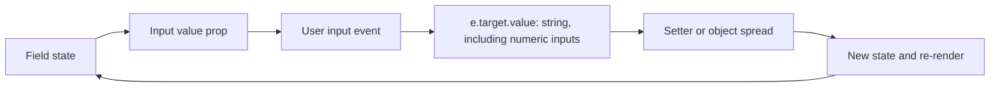

Text equivalent: state sets value; typing produces a string; setter updates state; rendering displays it. `type="number"` does not convert `e.target.value` into a JavaScript number. Create sends entered quantity/price as strings. Edit initially receives backend types; modified numeric fields become strings. No runtime numeric conversion is implemented.

Both forms call `e.preventDefault();` to stop normal browser form submission/page reload and send Axios requests instead. Create only rejects fields equal to `""` exactly; no trimming, URL validation, or numeric range checking exists. Edit has no equivalent application validation. Native number-input behavior is not a documented backend validation policy.

### Conditional rendering

This diagram separates Home's three branches from Edit's two.

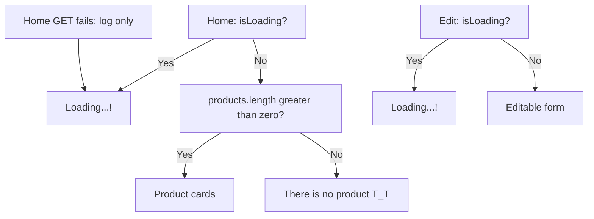

Text equivalent: Home shows loading, list, or empty; failed GET leaves loading true. Edit replaces its form during fetching/updating and restores it after GET success or error reset. Create leaves inputs visible but hides Save while pending, without a separate loading message.

## API and CRUD operations

### Product contract

Every request uses `${VITE_BACKEND_URL}` as base. Actual backend validation rules/status codes are unknown. This JSON is illustrative, not a fetched record:

```json
{
  "_id": "example-product-001",
  "name": "Notebook",
  "quantity": 12,
  "price": 4.5,
  "image": "https://example.com/notebook.png"
}
```

The backend supplies `_id` for keys and specific-product paths. `image` is a URL, not a file upload; this example URL is not verified. Price is shown with a literal `$` prefix without decimal formatting, localization, or currency selection.

| Operation | HTTP method | Path appended to base | Request / expected response |
| --- | --- | --- | --- |
| Read all | GET | `/api/products` | No body; direct JSON array of products, or `[]` |
| Read one | GET | `/api/products/:id` | No body; direct product object |
| Create | POST | `/api/products` | Sends `{ name, quantity, price, image }`; uses `response.data.name` for toast |
| Update | PUT | `/api/products/:id` | Sends four-field product object; response body unused |
| Delete | DELETE | `/api/products/:id` | No body; response body unused; list GET follows |

Replace `:id` with the real product ID. Axios `response.data` is its response body. Source does not unwrap `{ "products": [...] }` or `{ "product": {...} }`; list/object responses must be direct.

A **promise** represents an asynchronous result that resolves or rejects. **`async`/`await`** waits for that result within a function without blocking the whole browser UI. Axios returns promises; `try`/`catch` handles failures. Actual Home code includes:

```js
const response = await axios.get(`${VITE_BACKEND_URL}/api/products`);
setProducts(response.data);
```

### Read all

This sequence follows the initial effect through both request outcomes.

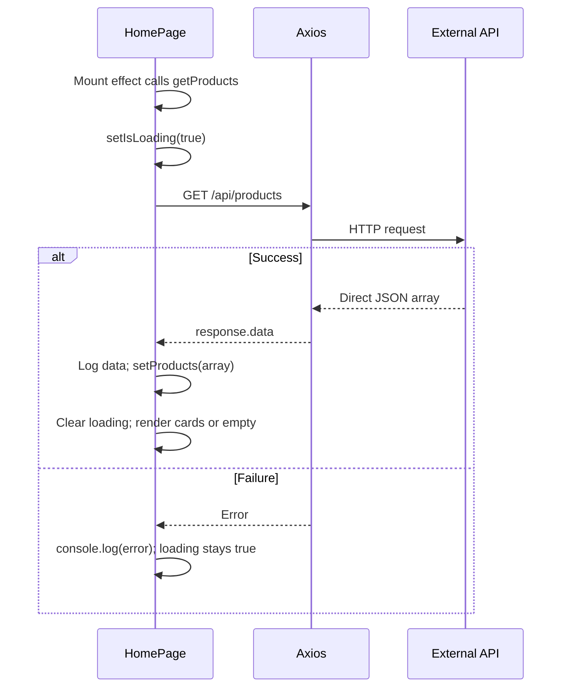

Text equivalent: mount → loading → GET → store array → clear loading → cards/empty. Failure logs to console and keeps loading visible with no error toast. Reload/remount can retry; clearing loading on failure requires a source change.

### Create

This flow shows exact validation and pending behavior.

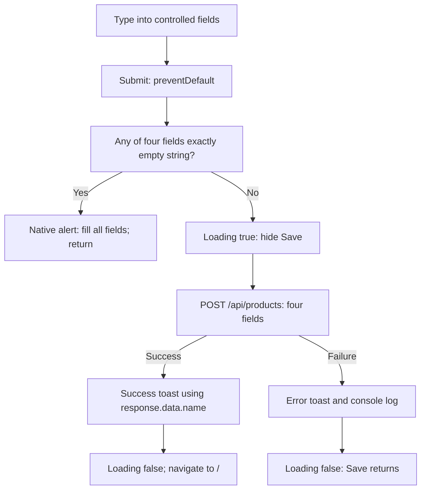

Text equivalent: typing updates state; submit prevents reload; exact empty strings trigger native alert and no request. Otherwise POST runs with Save hidden. Success toasts `Saved ... successfully!` using response name and returns home. Error toasts `error.message`, logs error, resets loading. Home mounts and fetches again after success navigation.

### Edit and update

This sequence separates initial fetch from saving edits.

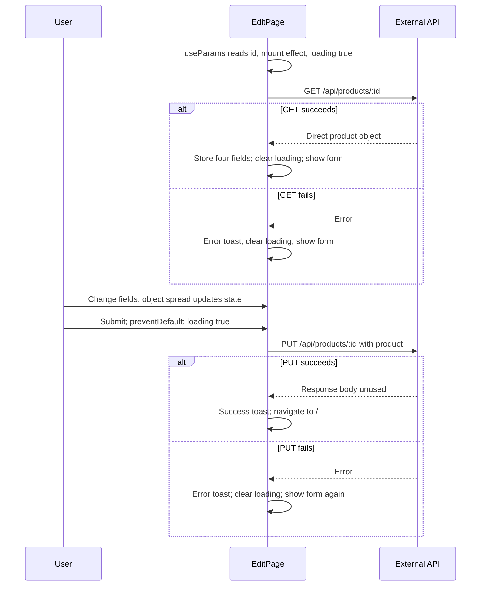

Text equivalent: route ID → GET → populated four-field form → edits → PUT. Failed initial GET exposes existing state, initially blank, after clearing loading. Failed PUT restores entered values. Success toasts `Updated ... successfully!` and returns home; loading is not reset first because navigation leaves the page.

### Delete

This flow distinguishes cancellation, deletion failure, and separate refresh failure.

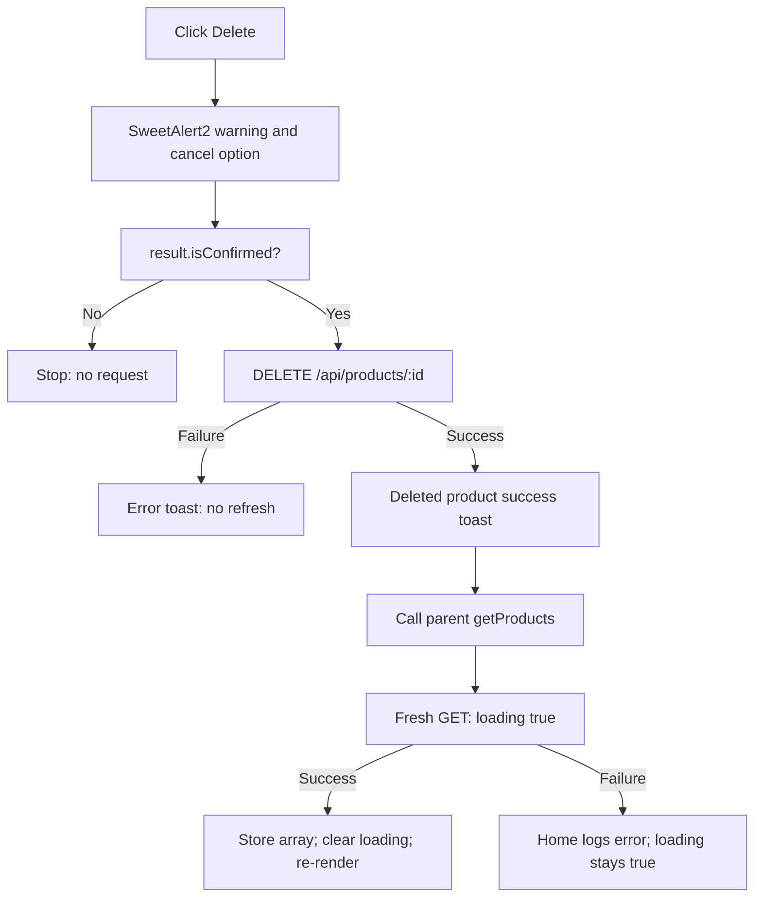

Text equivalent: cancel sends nothing; confirm sends DELETE; failure shows error toast with no refresh. Success toasts `Deleted ... successfully!` and calls Home's `getProducts()`. Refresh can fail after deletion succeeded. Product invokes the callback without awaiting its promise; there is no optimistic removal or delete-specific pending state.

### Notifications

App's global ToastContainer displays Create/Edit/Product notifications. SweetAlert2 confirms delete; Create's missing-fields feedback is native `alert`. Error toasts use `error.message`, not a custom backend-validation parser. Home logs errors only. Console output is visible in browser developer tools, not the page.

## Styling and deployment

Tailwind classes are small styling utilities applied via JSX `className`. Home uses:

```jsx
<div className="grid grid-cols-2 lg:grid-cols-4 gap-4 mt-5">
```

`grid` enables CSS Grid, `grid-cols-2` sets two columns, `lg:grid-cols-4` sets four at the large breakpoint, `gap-4` adds gaps, `mt-5` adds top margin. App's `container mx-auto p-3` constrains width, centers, and adds padding. Product's `w-full h-50 object-cover` fills width, fixes image height and crops to fit. `hover:bg-blue-600` changes background on hover; `max-w-lg bg-white shadow-lg` styles forms.

`src/index.css` starts with `@import "tailwindcss";`; the base layer uses `@apply bg-slate-400;` on body. Vite registers React/Tailwind plugins; there is no separate Tailwind configuration file.

This pipeline keeps lint and the external API separate from frontend transforms.

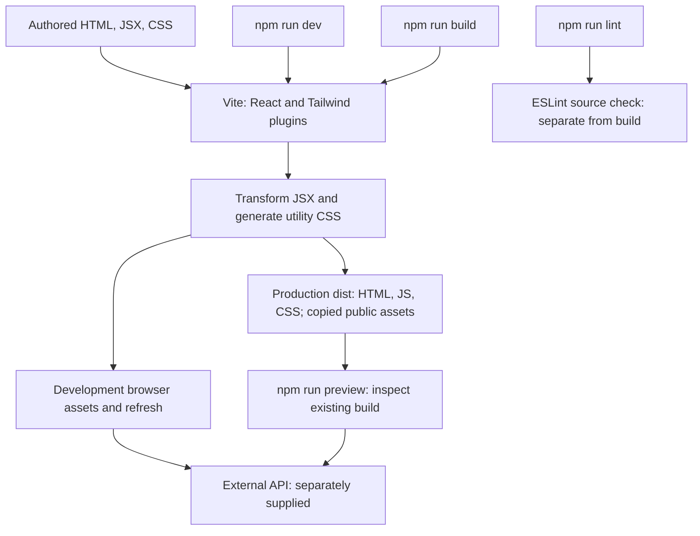

Text equivalent: dev/build use plugin transformations; dev serves modules with refresh; build writes static `dist`; preview serves that build locally. Lint is separate. No workflow starts an API.

For deployment, build with the intended public API base URL and serve `dist/` with a static host. BrowserRouter needs host fallback to `index.html` for direct visits/refreshes at `/create` and `/edit/:id`; otherwise server 404s may occur. This fallback serves the frontend document, not API endpoints. Configure API CORS for the deployed frontend origin, accessible images, and compatible HTTPS usage.

No provider/deployment configuration is supplied. Preview is local inspection, not production hosting. Rebuild/redeploy after production API configuration changes. Existing output was inventoried, not proof that current source builds or CRUD works.

## Troubleshooting and limitations

### Symptoms and actions

| Symptom | Relevant files/evidence | Action and responsibility |
| --- | --- | --- |
| Wrong request path, `undefined` URL, or requests missing API | `src/App.jsx`; Network tab | **Setup:** correct base URL, omit trailing slash and `/api/products`, restart Vite or rebuild production. |
| Connection refused/network/server error | Page/Product Axios calls; Network tab | **Setup/backend:** separately supplied API must be reachable and implement contract; no backend can start here. |
| Browser CORS error | Console; external server | **Backend:** allow actual frontend origin, methods/headers and preflight as needed. Other tools' access does not prove browser access. |
| Home stuck on `Loading...!` | `HomePage.jsx` catch | **Setup/backend:** resolve failure and reload/remount. **Source change needed:** clear loading and show visible error feedback. |
| Missing fields, wrong list, `.map()` error | Home/Edit; API JSON | **Backend contract:** return direct array for list and direct object for one, with expected fields; no schema checking/unwrap exists. |
| Broken images | `Product.jsx`; API image URL | **Data/setup:** check URL access, spelling, availability, HTTPS restrictions. **Source change needed:** alt text and fallback. |
| Engine warnings/tool incompatibility | Node version; package manifests | **Setup:** compatible Node 24, reopen terminal, `npm ci` if needed; old Node 18 instructions are insufficient. |
| No app on 5173 | Vite terminal | **Setup:** use printed URL; backend CORS must allow actual origin/port. |
| Nested route refresh returns 404 | BrowserRouter in main; static host | **Hosting:** fallback to `index.html`; distinct from API routing. |
| Duplicate initial development GETs | StrictMode; fetch effects | **Understanding:** development checks repeat effects. **Source change needed:** cleanup/cancellation and effect design where needed. |
| Changed ID in same mounted Edit shows old data | `EditPage.jsx` empty dependencies | **Source change needed:** respond to ID changes. |
| Lint exits unsuccessfully | Home/Edit; `eslint.config.js` | **Source change needed:** resolve verified findings below. |

### Verified lint output

`npm run lint` was run without starting Vite or loading environment files. It exited with two errors and one warning:

- `src/pages/HomePage.jsx:28`: `react-hooks/set-state-in-effect` error at effect's `getProducts()` call, whose synchronous portion sets loading state.
- `src/pages/EditPage.jsx:50`: same error at `getProduct()`.
- `src/pages/EditPage.jsx:51`: `react-hooks/exhaustive-deps` warning for missing `getProduct` dependency.

App's component-plus-configuration export can interact with React Refresh rules, but this check did **not** report a Refresh failure. Documentation does not fix source findings; lint is not a live CRUD test.

### Remaining limitations

- Create validates exact empty strings only; Edit lacks equivalent application validation. No numeric conversion, URL validation, range checks. Backend rules/status codes remain unknown.
- No application-configured request timeout, cancellation, retries, or optimistic updates. Pending requests can keep pending UI visible.
- Product images lack `alt` and fallback. Labels lack explicit input associations using IDs and `htmlFor`.
- No authentication, search, pagination, uploads, automated tests, or test script.
- `_id` does not establish a database; no backend implementation/schema exists here.
- `.env` is not explicitly ignored; protect configuration without assuming an environment file is committed/correct.
- `learn.html` and some comments describe earlier behavior; executable source is authoritative.
- No license file or verified demo URL. Third-party package licenses do not supply this repository's license.

Only documentation changed. No build, dev/preview server, or live API test was run for this update. Environment files were not read; compiled configuration values were not extracted. Diagrams include text equivalents for readers without Mermaid support.

Documentation checks verified all 17 direct packages, all 233 inventory rows, internal section links, balanced Markdown fences, and valid example JSON. The 12 diagrams were reviewed for Mermaid syntax and flow accuracy, but were not rendered with a Mermaid engine. PNG artwork was visually viewed; SVG markup and references were inspected, but local SVG browser previews were blocked by the browser's URL policy.

## Glossary and reading order

| Term | Meaning here |
| --- | --- |
| Frontend / backend | Browser UI / external API and persistence server |
| API / HTTP / endpoint | Contract / request-response protocol / method and server path |
| JSON | Data text format for objects/arrays |
| JSX / component | JavaScript UI syntax / reusable UI function |
| DOM / render | Browser element tree / calculate and display UI |
| Props / state | Parent-provided inputs / remembered data |
| Hook / effect | React capability function / post-render synchronization |
| Controlled input | Form field whose value and changes follow state |
| Routing / route parameter | Choose UI by URL / variable path segment |
| Promise / async/await | Future success/failure result / syntax for awaiting it |
| Callback | Function passed for later invocation |
| Environment variable | Named configuration, public backend URL here |
| Direct / transitive dependency | Listed project package / package required through another |
| Bundler / linting | Transform/package assets / statically check rules |
| CORS / origin | Server policy permitting cross-origin access / scheme, host, port |
| Mount / re-render | Initial UI insertion / recalculation after changes |
| ES module | File using `import`/`export`, enabled by package module mode |
| Toast / optimistic update | Brief notification / UI change before server success, absent here |

Suggested source reading order:

1. `index.html`: root and module script.
2. `src/main.jsx`: imports and wrappers.
3. `src/App.jsx`: routes, shell, ToastContainer, configuration.
4. `src/pages/HomePage.jsx`: state, effect, GET, branches, mapping.
5. `src/components/Product.jsx`: props, edit path, confirm, DELETE, callback.
6. `src/pages/CreatePage.jsx`: fields, validation, POST, pending UI, redirect.
7. `src/pages/EditPage.jsx`: parameter, GET, spread, PUT, failures.
8. `src/index.css`, `vite.config.js`, `eslint.config.js`, `package.json`, `.gitignore`, then `package-lock.json`: styling, tools, scripts, ignores, resolution.

Read `learn.html` later as a standalone CSS exercise, separating historical descriptions from current behavior.

## Complete dependency inventory

The complete current lockfile was parsed and each corresponding installed manifest checked. `README-dependency-inventory.md` matches current paths, versions, installed status, development/optional flags. This appendix is generated from current metadata rather than merely linking that support artifact.

There are **233 locked package entries**, excluding root project metadata: **17 direct paths**, **216 transitive paths**. **187 are installed**, **46 not installed** locally. **196 carry the development flag**, **50 the optional flag**; categories overlap. All installed versions match locked versions. Counts describe paths, not necessarily unique names, and are a local snapshot that can change across installations/platforms.

Development records lockfile `dev`: false means absent/false, not that application code imports the package directly. Optional records the optional flag. Platform-specific native packages declare OS/CPU constraints and may be omitted locally; locked availability differs from installation. Four optional entries are installed here. Nested paths distinguish versions, including Lightning CSS. Node engines come from installed manifests when available, otherwise lock metadata; a dash means no declared engine in that metadata. Inventory facts are provided without guessed roles for unfamiliar transitive libraries.

<details>
<summary>Expand all 233 locked dependency entries</summary>

| Package path | Locked version | Installed version / status | Development | Optional | Node engine |
| --- | --- | --- | --- | --- | --- |
| node_modules/@babel/code-frame | 7.29.7 | 7.29.7 | true | false | >=6.9.0 |
| node_modules/@babel/compat-data | 7.29.7 | 7.29.7 | true | false | >=6.9.0 |
| node_modules/@babel/core | 7.29.7 | 7.29.7 | true | false | >=6.9.0 |
| node_modules/@babel/generator | 7.29.8 | 7.29.8 | true | false | >=6.9.0 |
| node_modules/@babel/helper-compilation-targets | 7.29.7 | 7.29.7 | true | false | >=6.9.0 |
| node_modules/@babel/helper-globals | 7.29.7 | 7.29.7 | true | false | >=6.9.0 |
| node_modules/@babel/helper-module-imports | 7.29.7 | 7.29.7 | true | false | >=6.9.0 |
| node_modules/@babel/helper-module-transforms | 7.29.7 | 7.29.7 | true | false | >=6.9.0 |
| node_modules/@babel/helper-string-parser | 7.29.7 | 7.29.7 | true | false | >=6.9.0 |
| node_modules/@babel/helper-validator-identifier | 7.29.7 | 7.29.7 | true | false | >=6.9.0 |
| node_modules/@babel/helper-validator-option | 7.29.7 | 7.29.7 | true | false | >=6.9.0 |
| node_modules/@babel/helpers | 7.29.7 | 7.29.7 | true | false | >=6.9.0 |
| node_modules/@babel/parser | 7.29.9 | 7.29.9 | true | false | >=6.0.0 |
| node_modules/@babel/template | 7.29.7 | 7.29.7 | true | false | >=6.9.0 |
| node_modules/@babel/traverse | 7.29.8 | 7.29.8 | true | false | >=6.9.0 |
| node_modules/@babel/types | 7.29.8 | 7.29.8 | true | false | >=6.9.0 |
| node_modules/@cacheable/memory | 2.2.0 | 2.2.0 | true | false | - |
| node_modules/@cacheable/utils | 2.5.0 | 2.5.0 | true | false | - |
| node_modules/@eslint-community/eslint-utils | 4.10.1 | 4.10.1 | true | false | ^12.22.0 \|\| ^14.17.0 \|\| >=16.0.0 |
| node_modules/@eslint-community/eslint-utils/node_modules/eslint-visitor-keys | 3.4.3 | 3.4.3 | true | false | ^12.22.0 \|\| ^14.17.0 \|\| >=16.0.0 |
| node_modules/@eslint-community/regexpp | 4.12.2 | 4.12.2 | true | false | ^12.0.0 \|\| ^14.0.0 \|\| >=16.0.0 |
| node_modules/@eslint/config-array | 0.23.5 | 0.23.5 | true | false | ^20.19.0 \|\| ^22.13.0 \|\| >=24 |
| node_modules/@eslint/config-helpers | 0.7.0 | 0.7.0 | true | false | ^20.19.0 \|\| ^22.13.0 \|\| >=24 |
| node_modules/@eslint/core | 1.2.1 | 1.2.1 | true | false | ^20.19.0 \|\| ^22.13.0 \|\| >=24 |
| node_modules/@eslint/js | 10.0.1 | 10.0.1 | true | false | ^20.19.0 \|\| ^22.13.0 \|\| >=24 |
| node_modules/@eslint/object-schema | 3.0.5 | 3.0.5 | true | false | ^20.19.0 \|\| ^22.13.0 \|\| >=24 |
| node_modules/@eslint/plugin-kit | 0.7.3 | 0.7.3 | true | false | ^20.19.0 \|\| ^22.13.0 \|\| >=24 |
| node_modules/@humanfs/core | 0.19.2 | 0.19.2 | true | false | >=18.18.0 |
| node_modules/@humanfs/node | 0.16.8 | 0.16.8 | true | false | >=18.18.0 |
| node_modules/@humanfs/types | 0.15.0 | 0.15.0 | true | false | >=18.18.0 |
| node_modules/@humanwhocodes/module-importer | 1.0.1 | 1.0.1 | true | false | >=12.22 |
| node_modules/@humanwhocodes/retry | 0.4.3 | 0.4.3 | true | false | >=18.18 |
| node_modules/@jridgewell/gen-mapping | 0.3.13 | 0.3.13 | true | false | - |
| node_modules/@jridgewell/remapping | 2.3.5 | 2.3.5 | true | false | - |
| node_modules/@jridgewell/resolve-uri | 3.1.2 | 3.1.2 | true | false | >=6.0.0 |
| node_modules/@jridgewell/sourcemap-codec | 1.6.0 | 1.6.0 | true | false | - |
| node_modules/@jridgewell/trace-mapping | 0.3.31 | 0.3.31 | true | false | - |
| node_modules/@keyv/bigmap | 1.3.1 | 1.3.1 | true | false | >= 18 |
| node_modules/@keyv/serialize | 1.1.1 | 1.1.1 | true | false | - |
| node_modules/@oxc-project/types | 0.151.0 | 0.151.0 | true | false | - |
| node_modules/@rolldown/binding-android-arm-eabi | 1.2.11 | not installed | true | true | ^20.19.0 \|\| >=22.12.0 |
| node_modules/@rolldown/binding-android-arm64 | 1.2.11 | not installed | true | true | ^20.19.0 \|\| >=22.12.0 |
| node_modules/@rolldown/binding-darwin-arm64 | 1.2.11 | not installed | true | true | ^20.19.0 \|\| >=22.12.0 |
| node_modules/@rolldown/binding-darwin-x64 | 1.2.11 | not installed | true | true | ^20.19.0 \|\| >=22.12.0 |
| node_modules/@rolldown/binding-freebsd-x64 | 1.2.11 | not installed | true | true | ^20.19.0 \|\| >=22.12.0 |
| node_modules/@rolldown/binding-linux-arm-gnueabihf | 1.2.11 | not installed | true | true | ^20.19.0 \|\| >=22.12.0 |
| node_modules/@rolldown/binding-linux-arm64-gnu | 1.2.11 | not installed | true | true | ^20.19.0 \|\| >=22.12.0 |
| node_modules/@rolldown/binding-linux-arm64-musl | 1.2.11 | not installed | true | true | ^20.19.0 \|\| >=22.12.0 |
| node_modules/@rolldown/binding-linux-ppc64-gnu | 1.2.11 | not installed | true | true | ^20.19.0 \|\| >=22.12.0 |
| node_modules/@rolldown/binding-linux-s390x-gnu | 1.2.11 | not installed | true | true | ^20.19.0 \|\| >=22.12.0 |
| node_modules/@rolldown/binding-linux-x64-gnu | 1.2.11 | not installed | true | true | ^20.19.0 \|\| >=22.12.0 |
| node_modules/@rolldown/binding-linux-x64-musl | 1.2.11 | not installed | true | true | ^20.19.0 \|\| >=22.12.0 |
| node_modules/@rolldown/binding-openharmony-arm64 | 1.2.11 | not installed | true | true | ^20.19.0 \|\| >=22.12.0 |
| node_modules/@rolldown/binding-win32-arm64-msvc | 1.2.11 | not installed | true | true | ^20.19.0 \|\| >=22.12.0 |
| node_modules/@rolldown/binding-win32-x64-msvc | 1.2.11 | 1.2.11 | true | true | ^20.19.0 \|\| >=22.12.0 |
| node_modules/@rolldown/pluginutils | 1.0.1 | 1.0.1 | true | false | - |
| node_modules/@tailwindcss/node | 4.3.3 | 4.3.3 | true | false | - |
| node_modules/@tailwindcss/node/node_modules/lightningcss | 1.32.0 | 1.32.0 | true | false | >= 12.0.0 |
| node_modules/@tailwindcss/node/node_modules/lightningcss-android-arm64 | 1.32.0 | not installed | true | true | >= 12.0.0 |
| node_modules/@tailwindcss/node/node_modules/lightningcss-darwin-arm64 | 1.32.0 | not installed | true | true | >= 12.0.0 |
| node_modules/@tailwindcss/node/node_modules/lightningcss-darwin-x64 | 1.32.0 | not installed | true | true | >= 12.0.0 |
| node_modules/@tailwindcss/node/node_modules/lightningcss-freebsd-x64 | 1.32.0 | not installed | true | true | >= 12.0.0 |
| node_modules/@tailwindcss/node/node_modules/lightningcss-linux-arm-gnueabihf | 1.32.0 | not installed | true | true | >= 12.0.0 |
| node_modules/@tailwindcss/node/node_modules/lightningcss-linux-arm64-gnu | 1.32.0 | not installed | true | true | >= 12.0.0 |
| node_modules/@tailwindcss/node/node_modules/lightningcss-linux-arm64-musl | 1.32.0 | not installed | true | true | >= 12.0.0 |
| node_modules/@tailwindcss/node/node_modules/lightningcss-linux-x64-gnu | 1.32.0 | not installed | true | true | >= 12.0.0 |
| node_modules/@tailwindcss/node/node_modules/lightningcss-linux-x64-musl | 1.32.0 | not installed | true | true | >= 12.0.0 |
| node_modules/@tailwindcss/node/node_modules/lightningcss-win32-arm64-msvc | 1.32.0 | not installed | true | true | >= 12.0.0 |
| node_modules/@tailwindcss/node/node_modules/lightningcss-win32-x64-msvc | 1.32.0 | 1.32.0 | true | true | >= 12.0.0 |
| node_modules/@tailwindcss/oxide | 4.3.3 | 4.3.3 | true | false | >= 20 |
| node_modules/@tailwindcss/oxide-android-arm64 | 4.3.3 | not installed | true | true | >= 20 |
| node_modules/@tailwindcss/oxide-darwin-arm64 | 4.3.3 | not installed | true | true | >= 20 |
| node_modules/@tailwindcss/oxide-darwin-x64 | 4.3.3 | not installed | true | true | >= 20 |
| node_modules/@tailwindcss/oxide-freebsd-x64 | 4.3.3 | not installed | true | true | >= 20 |
| node_modules/@tailwindcss/oxide-linux-arm-gnueabihf | 4.3.3 | not installed | true | true | >= 20 |
| node_modules/@tailwindcss/oxide-linux-arm64-gnu | 4.3.3 | not installed | true | true | >= 20 |
| node_modules/@tailwindcss/oxide-linux-arm64-musl | 4.3.3 | not installed | true | true | >= 20 |
| node_modules/@tailwindcss/oxide-linux-x64-gnu | 4.3.3 | not installed | true | true | >= 20 |
| node_modules/@tailwindcss/oxide-linux-x64-musl | 4.3.3 | not installed | true | true | >= 20 |
| node_modules/@tailwindcss/oxide-wasm32-wasi | 4.3.3 | not installed | true | true | >=14.0.0 |
| node_modules/@tailwindcss/oxide-win32-arm64-msvc | 4.3.3 | not installed | true | true | >= 20 |
| node_modules/@tailwindcss/oxide-win32-x64-msvc | 4.3.3 | 4.3.3 | true | true | >= 20 |
| node_modules/@tailwindcss/vite | 4.3.3 | 4.3.3 | true | false | - |
| node_modules/@types/esrecurse | 4.3.1 | 4.3.1 | true | false | - |
| node_modules/@types/estree | 1.0.9 | 1.0.9 | true | false | - |
| node_modules/@types/json-schema | 7.0.15 | 7.0.15 | true | false | - |
| node_modules/@types/react | 19.3.0 | 19.3.0 | true | false | - |
| node_modules/@types/react-dom | 19.3.0 | 19.3.0 | true | false | - |
| node_modules/@vitejs/plugin-react | 6.1.1 | 6.1.1 | true | false | ^20.19.0 \|\| >=22.12.0 |
| node_modules/acorn | 8.18.0 | 8.18.0 | true | false | >=0.4.0 |
| node_modules/acorn-jsx | 5.3.2 | 5.3.2 | true | false | - |
| node_modules/agent-base | 6.0.2 | 6.0.2 | false | false | >= 6.0.0 |
| node_modules/ajv | 6.15.0 | 6.15.0 | true | false | - |
| node_modules/asynckit | 0.4.0 | 0.4.0 | false | false | - |
| node_modules/axios | 1.20.0 | 1.20.0 | false | false | - |
| node_modules/balanced-match | 4.0.4 | 4.0.4 | true | false | 18 \|\| 20 \|\| >=22 |
| node_modules/baseline-browser-mapping | 2.11.26 | 2.11.26 | true | false | >=6.0.0 |
| node_modules/brace-expansion | 5.0.12 | 5.0.12 | true | false | 20 \|\| >=22 |
| node_modules/browserslist | 4.29.2 | 4.29.2 | true | false | ^6 \|\| ^7 \|\| ^8 \|\| ^9 \|\| ^10 \|\| ^11 \|\| ^12 \|\| >=13.7 |
| node_modules/cacheable | 2.5.0 | 2.5.0 | true | false | - |
| node_modules/call-bind-apply-helpers | 1.0.2 | 1.0.2 | false | false | >= 0.4 |
| node_modules/caniuse-lite | 1.0.30001813 | 1.0.30001813 | true | false | - |
| node_modules/clsx | 2.1.1 | 2.1.1 | false | false | >=6 |
| node_modules/combined-stream | 1.0.8 | 1.0.8 | false | false | >= 0.8 |
| node_modules/convert-source-map | 2.0.0 | 2.0.0 | true | false | - |
| node_modules/cookie | 1.1.1 | 1.1.1 | false | false | >=18 |
| node_modules/cross-spawn | 7.0.6 | 7.0.6 | true | false | >= 8 |
| node_modules/csstype | 3.2.3 | 3.2.3 | true | false | - |
| node_modules/debug | 4.4.3 | 4.4.3 | false | false | >=6.0 |
| node_modules/deep-is | 0.1.4 | 0.1.4 | true | false | - |
| node_modules/delayed-stream | 1.0.0 | 1.0.0 | false | false | >=0.4.0 |
| node_modules/detect-libc | 2.1.2 | 2.1.2 | true | false | >=8 |
| node_modules/dunder-proto | 1.0.1 | 1.0.1 | false | false | >= 0.4 |
| node_modules/electron-to-chromium | 1.5.440 | 1.5.440 | true | false | - |
| node_modules/enhanced-resolve | 5.26.0 | 5.26.0 | true | false | >=10.13.0 |
| node_modules/es-define-property | 1.0.1 | 1.0.1 | false | false | >= 0.4 |
| node_modules/es-errors | 1.3.0 | 1.3.0 | false | false | >= 0.4 |
| node_modules/es-object-atoms | 1.1.2 | 1.1.2 | false | false | >= 0.4 |
| node_modules/es-set-tostringtag | 2.1.0 | 2.1.0 | false | false | >= 0.4 |
| node_modules/escalade | 3.2.0 | 3.2.0 | true | false | >=6 |
| node_modules/escape-string-regexp | 4.0.0 | 4.0.0 | true | false | >=10 |
| node_modules/eslint | 10.11.0 | 10.11.0 | true | false | ^20.19.0 \|\| ^22.13.0 \|\| >=24 |
| node_modules/eslint-plugin-react-hooks | 7.1.1 | 7.1.1 | true | false | >=18 |
| node_modules/eslint-plugin-react-refresh | 0.5.7 | 0.5.7 | true | false | - |
| node_modules/eslint-scope | 9.1.2 | 9.1.2 | true | false | ^20.19.0 \|\| ^22.13.0 \|\| >=24 |
| node_modules/eslint-visitor-keys | 5.0.1 | 5.0.1 | true | false | ^20.19.0 \|\| ^22.13.0 \|\| >=24 |
| node_modules/espree | 11.2.0 | 11.2.0 | true | false | ^20.19.0 \|\| ^22.13.0 \|\| >=24 |
| node_modules/esquery | 1.7.0 | 1.7.0 | true | false | >=0.10 |
| node_modules/esrecurse | 4.3.0 | 4.3.0 | true | false | >=4.0 |
| node_modules/estraverse | 5.3.0 | 5.3.0 | true | false | >=4.0 |
| node_modules/esutils | 2.0.3 | 2.0.3 | true | false | >=0.10.0 |
| node_modules/fast-deep-equal | 3.1.3 | 3.1.3 | true | false | - |
| node_modules/fast-json-stable-stringify | 2.1.0 | 2.1.0 | true | false | - |
| node_modules/fast-levenshtein | 2.0.6 | 2.0.6 | true | false | - |
| node_modules/fdir | 6.5.0 | 6.5.0 | true | false | >=12.0.0 |
| node_modules/file-entry-cache | 11.1.5 | 11.1.5 | true | false | - |
| node_modules/find-up | 5.0.0 | 5.0.0 | true | false | >=10 |
| node_modules/flat-cache | 6.1.23 | 6.1.23 | true | false | - |
| node_modules/flatted | 3.4.4 | 3.4.4 | true | false | - |
| node_modules/follow-redirects | 1.16.0 | 1.16.0 | false | false | >=4.0 |
| node_modules/form-data | 4.0.6 | 4.0.6 | false | false | >= 6 |
| node_modules/fsevents | 2.3.3 | not installed | true | true | ^8.16.0 \|\| ^10.6.0 \|\| >=11.0.0 |
| node_modules/function-bind | 1.1.2 | 1.1.2 | false | false | - |
| node_modules/gensync | 1.0.0-beta.2 | 1.0.0-beta.2 | true | false | >=6.9.0 |
| node_modules/get-intrinsic | 1.3.0 | 1.3.0 | false | false | >= 0.4 |
| node_modules/get-proto | 1.0.1 | 1.0.1 | false | false | >= 0.4 |
| node_modules/glob-parent | 6.0.2 | 6.0.2 | true | false | >=10.13.0 |
| node_modules/globals | 17.12.0 | 17.12.0 | true | false | >=18 |
| node_modules/gopd | 1.2.0 | 1.2.0 | false | false | >= 0.4 |
| node_modules/graceful-fs | 4.2.11 | 4.2.11 | true | false | - |
| node_modules/has-symbols | 1.1.0 | 1.1.0 | false | false | >= 0.4 |
| node_modules/has-tostringtag | 1.0.2 | 1.0.2 | false | false | >= 0.4 |
| node_modules/hashery | 1.5.1 | 1.5.1 | true | false | >=20 |
| node_modules/hasown | 2.0.4 | 2.0.4 | false | false | >= 0.4 |
| node_modules/hermes-estree | 0.25.1 | 0.25.1 | true | false | - |
| node_modules/hermes-parser | 0.25.1 | 0.25.1 | true | false | - |
| node_modules/hookified | 1.15.1 | 1.15.1 | true | false | - |
| node_modules/https-proxy-agent | 5.0.1 | 5.0.1 | false | false | >= 6 |
| node_modules/ignore | 5.3.2 | 5.3.2 | true | false | >= 4 |
| node_modules/imurmurhash | 0.1.4 | 0.1.4 | true | false | >=0.8.19 |
| node_modules/is-extglob | 2.1.1 | 2.1.1 | true | false | >=0.10.0 |
| node_modules/is-glob | 4.0.3 | 4.0.3 | true | false | >=0.10.0 |
| node_modules/isexe | 2.0.0 | 2.0.0 | true | false | - |
| node_modules/jiti | 2.7.0 | 2.7.0 | true | false | - |
| node_modules/js-tokens | 4.0.0 | 4.0.0 | true | false | - |
| node_modules/jsesc | 3.1.0 | 3.1.0 | true | false | >=6 |
| node_modules/json-schema-traverse | 0.4.1 | 0.4.1 | true | false | - |
| node_modules/json-stable-stringify-without-jsonify | 1.0.1 | 1.0.1 | true | false | - |
| node_modules/json5 | 2.2.3 | 2.2.3 | true | false | >=6 |
| node_modules/keyv | 5.6.0 | 5.6.0 | true | false | - |
| node_modules/levn | 0.4.1 | 0.4.1 | true | false | >= 0.8.0 |
| node_modules/lightningcss | 1.33.0 | 1.33.0 | true | false | >= 12.0.0 |
| node_modules/lightningcss-android-arm64 | 1.33.0 | not installed | true | true | >= 12.0.0 |
| node_modules/lightningcss-darwin-arm64 | 1.33.0 | not installed | true | true | >= 12.0.0 |
| node_modules/lightningcss-darwin-x64 | 1.33.0 | not installed | true | true | >= 12.0.0 |
| node_modules/lightningcss-freebsd-x64 | 1.33.0 | not installed | true | true | >= 12.0.0 |
| node_modules/lightningcss-linux-arm-gnueabihf | 1.33.0 | not installed | true | true | >= 12.0.0 |
| node_modules/lightningcss-linux-arm64-gnu | 1.33.0 | not installed | true | true | >= 12.0.0 |
| node_modules/lightningcss-linux-arm64-musl | 1.33.0 | not installed | true | true | >= 12.0.0 |
| node_modules/lightningcss-linux-x64-gnu | 1.33.0 | not installed | true | true | >= 12.0.0 |
| node_modules/lightningcss-linux-x64-musl | 1.33.0 | not installed | true | true | >= 12.0.0 |
| node_modules/lightningcss-win32-arm64-msvc | 1.33.0 | not installed | true | true | >= 12.0.0 |
| node_modules/lightningcss-win32-x64-msvc | 1.33.0 | 1.33.0 | true | true | >= 12.0.0 |
| node_modules/locate-path | 6.0.0 | 6.0.0 | true | false | >=10 |
| node_modules/lru-cache | 5.1.1 | 5.1.1 | true | false | - |
| node_modules/magic-string | 0.30.21 | 0.30.21 | true | false | - |
| node_modules/math-intrinsics | 1.1.0 | 1.1.0 | false | false | >= 0.4 |
| node_modules/mime-db | 1.52.0 | 1.52.0 | false | false | >= 0.6 |
| node_modules/mime-types | 2.1.35 | 2.1.35 | false | false | >= 0.6 |
| node_modules/minimatch | 10.2.6 | 10.2.6 | true | false | 18 \|\| 20 \|\| >=22 |
| node_modules/ms | 2.1.3 | 2.1.3 | false | false | - |
| node_modules/nanoid | 3.3.19 | 3.3.19 | true | false | ^10 \|\| ^12 \|\| ^13.7 \|\| ^14 \|\| >=15.0.1 |
| node_modules/natural-compare | 1.4.0 | 1.4.0 | true | false | - |
| node_modules/node-releases | 2.0.57 | 2.0.57 | true | false | >=18 |
| node_modules/optionator | 0.9.4 | 0.9.4 | true | false | >= 0.8.0 |
| node_modules/p-limit | 3.1.0 | 3.1.0 | true | false | >=10 |
| node_modules/p-locate | 5.0.0 | 5.0.0 | true | false | >=10 |
| node_modules/path-exists | 4.0.0 | 4.0.0 | true | false | >=8 |
| node_modules/path-key | 3.1.1 | 3.1.1 | true | false | >=8 |
| node_modules/picocolors | 1.1.1 | 1.1.1 | true | false | - |
| node_modules/picomatch | 4.0.7 | 4.0.7 | true | false | >=12 |
| node_modules/postcss | 8.5.28 | 8.5.28 | true | false | ^10 \|\| ^12 \|\| >=14 |
| node_modules/prelude-ls | 1.2.1 | 1.2.1 | true | false | >= 0.8.0 |
| node_modules/proxy-from-env | 2.1.0 | 2.1.0 | false | false | >=10 |
| node_modules/punycode | 2.3.1 | 2.3.1 | true | false | >=6 |
| node_modules/qified | 0.10.1 | 0.10.1 | true | false | >=20 |
| node_modules/qified/node_modules/hookified | 2.2.0 | 2.2.0 | true | false | - |
| node_modules/react | 19.3.0 | 19.3.0 | false | false | >=0.10.0 |
| node_modules/react-dom | 19.3.0 | 19.3.0 | false | false | - |
| node_modules/react-router | 7.18.4 | 7.18.4 | false | false | >=20.0.0 |
| node_modules/react-router-dom | 7.18.4 | 7.18.4 | false | false | >=20.0.0 |
| node_modules/react-toastify | 11.1.0 | 11.1.0 | false | false | - |
| node_modules/rolldown | 1.2.11 | 1.2.11 | true | false | ^20.19.0 \|\| >=22.12.0 |
| node_modules/scheduler | 0.28.0 | 0.28.0 | false | false | - |
| node_modules/semver | 6.3.1 | 6.3.1 | true | false | - |
| node_modules/set-cookie-parser | 2.7.2 | 2.7.2 | false | false | - |
| node_modules/shebang-command | 2.0.0 | 2.0.0 | true | false | >=8 |
| node_modules/shebang-regex | 3.0.0 | 3.0.0 | true | false | >=8 |
| node_modules/source-map-js | 1.2.1 | 1.2.1 | true | false | >=0.10.0 |
| node_modules/sweetalert2 | 11.26.25 | 11.26.25 | false | false | - |
| node_modules/tailwindcss | 4.3.3 | 4.3.3 | true | false | - |
| node_modules/tapable | 2.3.3 | 2.3.3 | true | false | >=6 |
| node_modules/tinyglobby | 0.2.17 | 0.2.17 | true | false | >=12.0.0 |
| node_modules/type-check | 0.4.0 | 0.4.0 | true | false | >= 0.8.0 |
| node_modules/update-browserslist-db | 1.3.3 | 1.3.3 | true | false | - |
| node_modules/uri-js | 4.4.1 | 4.4.1 | true | false | - |
| node_modules/vite | 8.3.1 | 8.3.1 | true | false | ^20.19.0 \|\| >=22.12.0 |
| node_modules/which | 2.0.2 | 2.0.2 | true | false | >= 8 |
| node_modules/word-wrap | 1.2.5 | 1.2.5 | true | false | >=0.10.0 |
| node_modules/yallist | 3.1.1 | 3.1.1 | true | false | - |
| node_modules/yocto-queue | 0.1.0 | 0.1.0 | true | false | >=10 |
| node_modules/zod | 4.6.5 | 4.6.5 | true | false | - |
| node_modules/zod-validation-error | 4.0.2 | 4.0.2 | true | false | >=18.0.0 |

</details>
